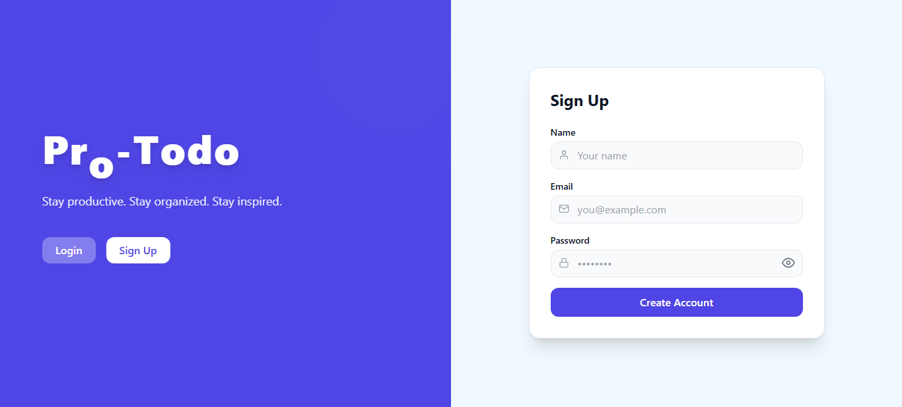
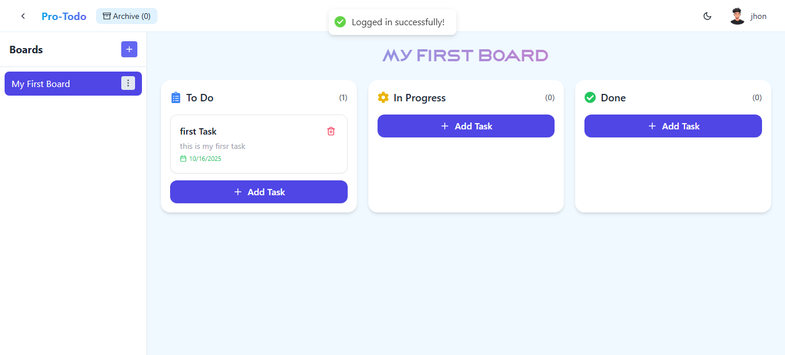

# React + Vite

# 🧩 ProTodo

A simple and modern Todo App built with **React.js**, **Node.js**, and **MongoDB**.  
Manage your daily tasks efficiently with drag & drop, categories, and a clean UI.

---

## 🚀 Features

- 🔐 User Authentication (Signup / Login)
- 🗂️ Create, Edit, and Delete Tasks
- 📦 Drag & Drop to manage tasks easily
- 🕓 Task Scheduling & Deadlines
- ☁️ Data stored securely in MongoDB
- 💻 Responsive and modern UI

---

## 🛠️ Tech Stack

**Frontend:** React.js, Vite, Tailwind CSS  
**Backend:** Node.js, Express.js  
**Database:** MongoDB (Mongoose)  
**Hosting:** Vercel / Netlify (Frontend), Render / Railway (Backend)

---

 # My App Screenshots
 
## Login Screen


## Dashboard



## ⚙️ Installation

 Clone the repo:
   ```bash
   git clone https://github.com/allenmiky/ProTodo01.git

 >> cd ProTodo01
 >> npm run npm install
 >> npm run install-all
 >> npm run dev

